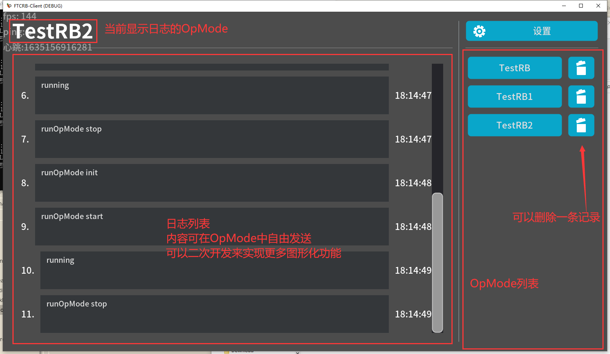

# FTCRB-Client
 
这是针对项目[FtcRobotController-RBServer](https://github.com/DeanNevan/FtcRobotController-RBServer)的示例客户端程序

参考上述链接的项目中的说明

使用 Godot游戏引擎v3.3.4 编写

包含连接RBServer、接收RobotEvent（重启机器人等）、接收OpModeLog、发送RobotRequest等功能

若要直接使用，请下载release版本

